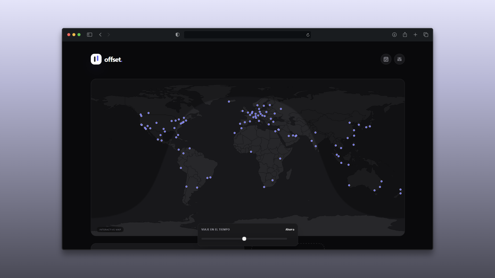

# offset.

> The modern way to coordinate global time. A minimalist world clock and meeting planner designed with "Technical Glass" aesthetics, performance, and privacy in mind.




## ✨ Features

- 🧠 **Smart Auto-Location:** Automatically detects your city, weather, and time via IP (with GPS fallback) using `ipwho.is`.
- 📅 **Meeting Planner:** Interactive 24h grid to find overlapping business hours across timezones. Includes color-coded availability.
- 🌍 **Global Search:** Search any city in the world using the Open-Meteo Geocoding API.
- 🛡️ **Backup & Restore:** Export your saved cities and configuration to a JSON file and restore them on any device.
- 📱 **PWA Ready:** Install Offset as a native app on iOS and Android. Works offline.
- 🌗 **Adaptive Themes:** Seamlessly switch between Light and Dark modes.
- ☁️ **Real-Time Weather:** Live temperature and condition icons for every saved city.
- 💾 **Local-First Persistence:** All settings are saved instantly to `localStorage`. No login required.

## 🛠️ Tech Stack

- **Framework:** [Next.js](https://nextjs.org/) (App Router & Server Components)
- **Styling:** [Tailwind CSS](https://tailwindcss.com/) (JIT Mode)
- **Interactions:** [dnd-kit](https://dndkit.com/) (Drag & Drop)
- **State Management:** [Zustand](https://github.com/pmndrs/zustand)
- **Time Logic:** `date-fns` & `date-fns-tz`
- **Data Sources:** Open-Meteo, ipwho.is, FlagCDN.

## 🚀 Getting Started

This project is built with Next.js and requires no external backend database (Local-First).

### Prerequisites

1. **Node.js** (v18 or higher)
2. **npm** or **pnpm**

### Installation

1. Clone the repo:

```bash
git clone https://github.com/EdvinCodes/offset.git
cd offset
```

2. Install dependencies:

```bash
npm install
```

3. Run the development server:

```bash
npm run dev
```

4. Open [http://localhost:3000](http://localhost:3000) with your browser.

## 🗺️ Roadmap

- [x] **MVP:** Local clock & basic city list
- [x] **UI:** Dark mode & "Glass" design system
- [x] **Search:** Global city search via API
- [x] **Persistence:** Save user cities via LocalStorage
- [x] **Productivity:** Meeting Planner with business hours
- [x] **Context:** Real-time weather and dynamic flags
- [x] **Themes:** Custom theme toggle (Light/Dark/System)
- [x] **Backup:** Export/Import settings as JSON
- [x] **PWA:** Install as a native app on mobile

## 📄 License

This project is open source and available under the [MIT License](https://www.google.com/search?q=LICENSE).

---

Developed with ❤️ by [Edvin](https://github.com/EdvinCodes)
